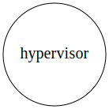

# install
```
cargo install sqlx-cli
sqlx database create
sqlx migration run 
```

# Internals
## Spawning process
To spawn a new task, the hypervisor will also spawn a **monitor** process, which
will track the state of the monitoree task executor process, and communicate it with the 
hypervisor.

Communication is made using 2 Unix Domain Socket:
* `monitor.sock` which is designed to handle unsolicited requests **from the hypervisor to the monitor**. (one `monitor.sock` per spawned task).
* `hypervisor.sock` which is designed to handle unsolicited requests **from the monitor to the hypervisor**.

The whole spawning process is described as follows:
<ol>
<li>
    <p>Starting from this state:</p>
    <p></p>
</li>

<li>
    <p>Spawning an task will fork the hypervisor process into a temporary process</p>
    <p></p>
</li>

<li>
    <p>the temporary process will then fork into a monitor process</p>
    <p></p>
</li>

<li>
    <p>the temporary process terminates, monitor is affected as a child of the PID 1 process by the kernel.</p>
    <p>The monitor process will then:
        <ul>
             <li> closes all opened file descriptor, </li>
             <li> detaches itself from its original TTY</li>
             <li> close all opened file descriptors </li>
             <li> reset its signal mask </li>
             <li> redirects its outputs to dedicated files </li>
             <li> change its working directory to a dedicated directory </li>
        </ul>
    </p>
    <p></p>
</li>

<li>
    <p>the monitor then forks into an executor process.</p>
    <p></p>
</li>

<li>
    <p>the executor calls <strong>execve()</strong> and runs the task, and the monitor start its monitoring event loop.</p>
    <p></p>
</li>

<li>
    <p>While the task is running in the executor, the monitor is listenning on its 
    <em>monitor.sock</em> unix domain socket for any commands from the hypervisor (status update, kill requests...).</p>
    <p></p>
</li>

<li>
    <p>When the task terminates, the executor sends a <strong>SIGCHLD</strong> signal to the monitor process.</p>
    <p></p>
</li>

<li>
    <p>The monitor then send the return status of the executor process to the hypervisor
    through the <em>hypervisor.sock</em> Unix domain socket.</p>
    <p></p>
</li>

<li>
    <p>The monitor write the executor task status into a dedicated file, remove the task PID file, and finally terminates</p>
    <p></p>
</li>

<li>
    We end up with the initial state.
    <p></p>
</li>
</ol>
